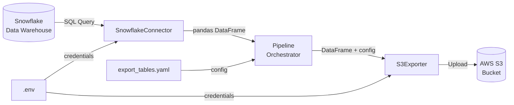
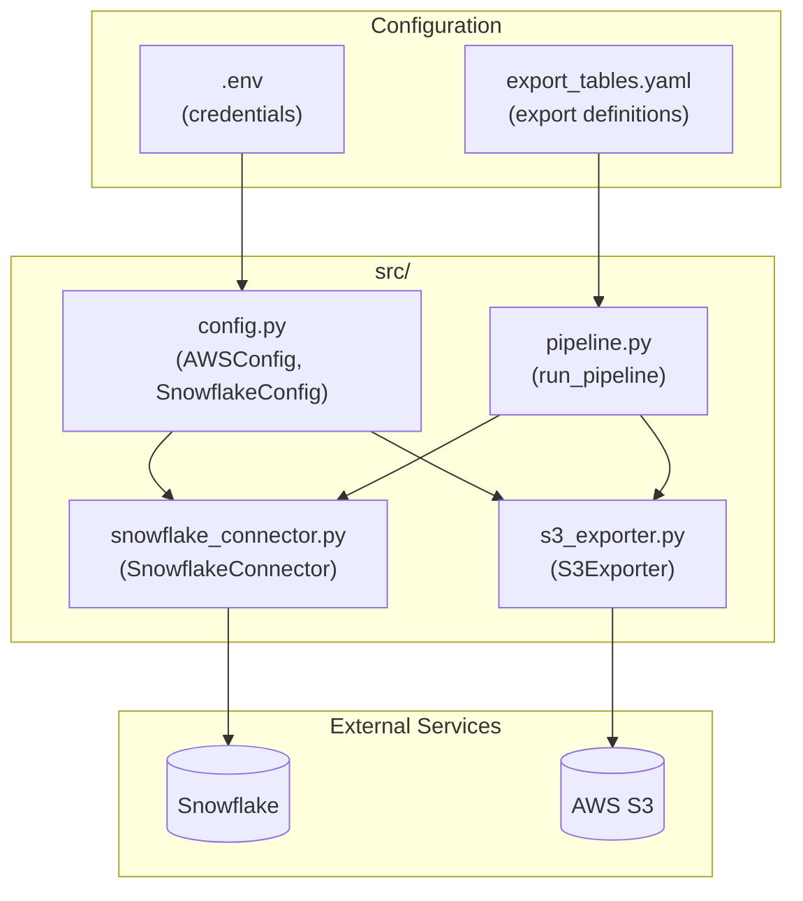
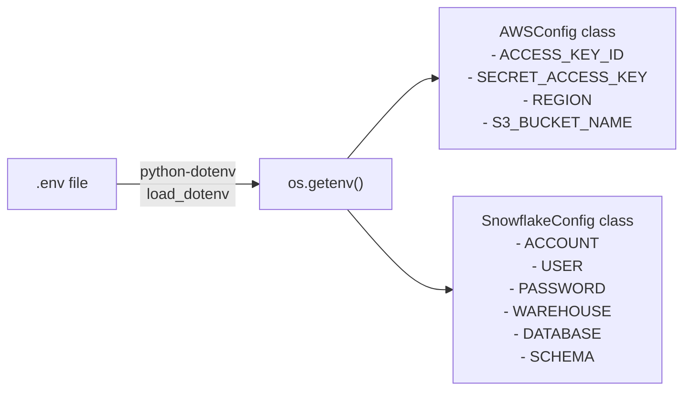
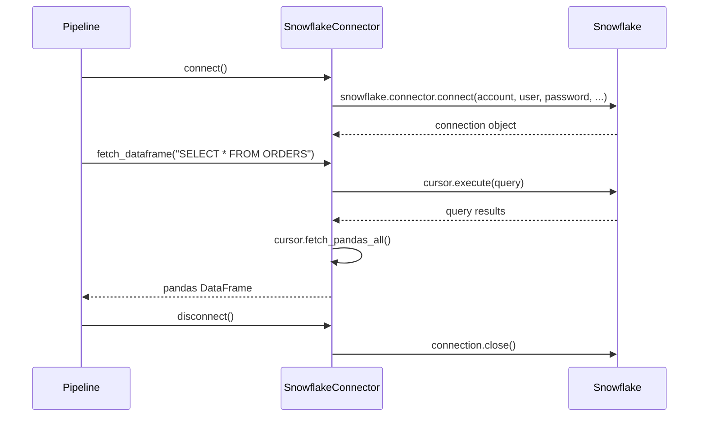
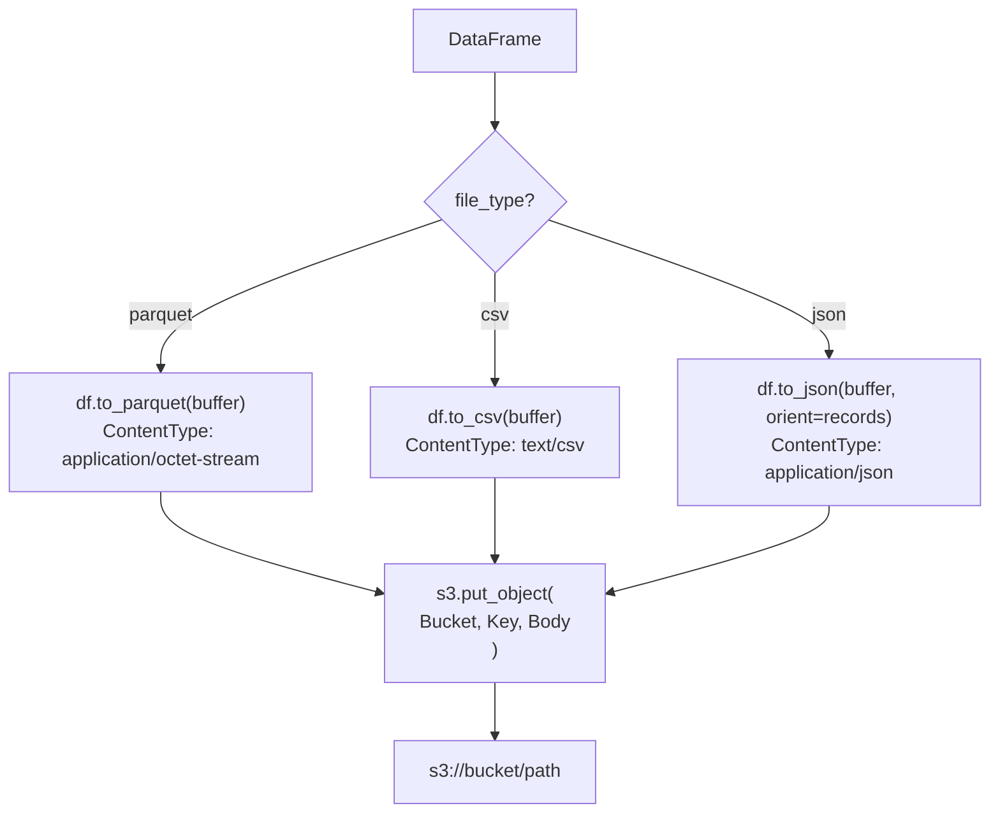
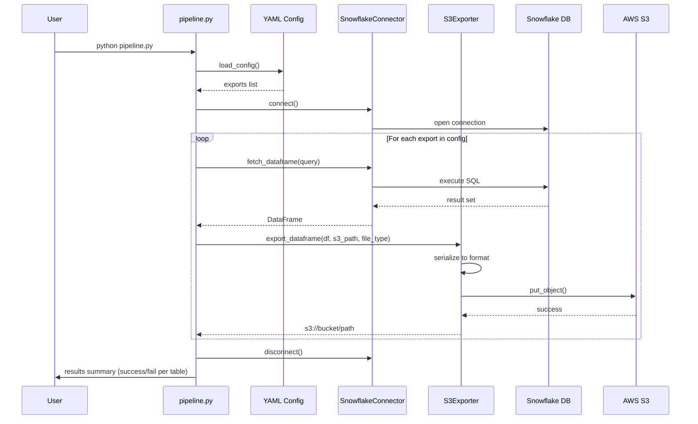
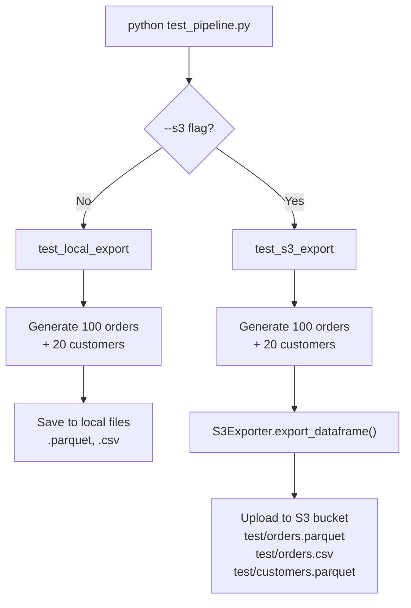
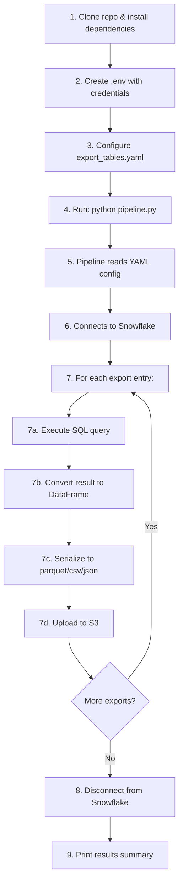

# Data Migration Pipeline - Project Report

## Table of Contents

1. [Project Overview](#1-project-overview)
2. [Architecture](#2-architecture)
3. [Project Structure](#3-project-structure)
4. [Prerequisites & Installation](#4-prerequisites--installation)
5. [Configuration](#5-configuration)
6. [Source Code Walkthrough](#6-source-code-walkthrough)
7. [Running the Pipeline](#7-running-the-pipeline)
8. [Testing](#8-testing)
9. [Pipeline Execution Flow](#9-pipeline-execution-flow)
10. [Output & Results](#10-output--results)

---

## 1. Project Overview

This project is a **Python-based data migration pipeline** that extracts data from **Snowflake** (a cloud data warehouse) and loads it into **AWS S3** (cloud object storage). The pipeline is configuration-driven using YAML files, supporting multiple output formats (Parquet, CSV, JSON).

### What the pipeline does

```
Snowflake (Source) ──> Python Pipeline ──> AWS S3 (Destination)
```

- Connects to a Snowflake database
- Executes SQL queries to extract data
- Converts query results into Pandas DataFrames
- Serializes DataFrames into the chosen file format
- Uploads the files to an S3 bucket

---

## 2. Architecture

### High-Level Architecture



### Component Interaction



---

## 3. Project Structure

```
data-migration/
├── config/
│   └── export_tables.yaml      # Defines which tables to export and how
├── src/
│   ├── __init__.py              # Package init
│   ├── config.py                # Reads credentials from .env
│   ├── snowflake_connector.py   # Handles Snowflake connections and queries
│   ├── s3_exporter.py           # Handles S3 uploads in various formats
│   ├── pipeline.py              # Main orchestrator that ties everything together
│   └── test_pipeline.py         # Test script with sample data (no Snowflake needed)
├── .env                         # Your credentials (not committed to git)
├── .env.example                 # Template for .env
├── requirements.txt             # Python dependencies
└── README.md                    # Project readme
```

---

## 4. Prerequisites & Installation

### Step 1: Install Python

Requires **Python 3.14+**. Verify with:

```bash
python --version
```

### Step 2: Clone the Repository

```bash
git clone <repository-url>
cd data-migration
```

### Step 3: Create a Virtual Environment

```bash
python -m venv venv
source venv/bin/activate   # macOS/Linux
# venv\Scripts\activate    # Windows
```

### Step 4: Install Dependencies

```bash
pip install -r requirements.txt
```

The following packages are installed:

| Package | Version | Purpose |
|---------|---------|---------|
| `boto3` | >= 1.28.0 | AWS SDK for S3 operations |
| `snowflake-connector-python` | >= 3.0.0 | Connect to Snowflake |
| `pandas` | >= 2.0.0 | Data manipulation (DataFrames) |
| `pyarrow` | >= 12.0.0 | Parquet file format support |
| `python-dotenv` | >= 1.0.0 | Load `.env` files |
| `pyyaml` | >= 6.0 | Parse YAML config files |

---

## 5. Configuration

### Step 5: Set Up Environment Variables

```bash
cp .env.example .env
```

Edit `.env` with your actual credentials:

```dotenv
# AWS Configuration
AWS_ACCESS_KEY_ID=AKIA...
AWS_SECRET_ACCESS_KEY=wJalr...
AWS_REGION=us-east-1
S3_BUCKET_NAME=your-bucket-name

# Snowflake Configuration
SNOWFLAKE_ACCOUNT=xy12345.us-east-1
SNOWFLAKE_USER=your_username
SNOWFLAKE_PASSWORD=your_password
SNOWFLAKE_WAREHOUSE=COMPUTE_WH
SNOWFLAKE_DATABASE=SNOWFLAKE_SAMPLE_DATA
SNOWFLAKE_SCHEMA=TPCH_SF1
```

**How credentials are loaded:**



### Step 6: Configure Exports

Edit `config/export_tables.yaml` to define what data to export:

```yaml
exports:
  - table: ORDERS                          # Table name (used for logging)
    s3_path: exports/orders/data.parquet   # Destination path in S3
    file_type: parquet                     # Output format: parquet, csv, or json
    query: null                            # null = SELECT * FROM ORDERS

  - table: CUSTOMER
    s3_path: exports/customer/data.parquet
    file_type: parquet
    query: null

  - table: RECENT_ORDERS
    s3_path: exports/recent_orders/data.parquet
    file_type: parquet
    query: "SELECT * FROM ORDERS WHERE O_ORDERDATE >= DATEADD(day, -7, CURRENT_DATE())"

  - table: ORDER_SUMMARY
    s3_path: exports/order_summary/data.csv
    file_type: csv
    query: "SELECT O_CUSTKEY, COUNT(*) as ORDER_COUNT, SUM(O_TOTALPRICE) as TOTAL_SPENT FROM ORDERS GROUP BY O_CUSTKEY"
```

**Each export entry has 4 fields:**

| Field | Required | Description |
|-------|----------|-------------|
| `table` | Yes | Name used for logging and as default table when `query` is null |
| `s3_path` | Yes | S3 object key (path inside the bucket) |
| `file_type` | No | `parquet` (default), `csv`, or `json` |
| `query` | No | Custom SQL query. If `null`, exports full table (`SELECT * FROM <table>`) |

---

## 6. Source Code Walkthrough

### 6.1 `config.py` - Configuration Loader

This module loads environment variables from `.env` and exposes them as class attributes.

```python
# Reads .env file into environment
load_dotenv()

class AWSConfig:
    ACCESS_KEY_ID = os.getenv("AWS_ACCESS_KEY_ID")
    SECRET_ACCESS_KEY = os.getenv("AWS_SECRET_ACCESS_KEY")
    REGION = os.getenv("AWS_REGION", "us-east-1")
    S3_BUCKET_NAME = os.getenv("S3_BUCKET_NAME")

class SnowflakeConfig:
    ACCOUNT = os.getenv("SNOWFLAKE_ACCOUNT")
    USER = os.getenv("SNOWFLAKE_USER")
    PASSWORD = os.getenv("SNOWFLAKE_PASSWORD")
    WAREHOUSE = os.getenv("SNOWFLAKE_WAREHOUSE")
    DATABASE = os.getenv("SNOWFLAKE_DATABASE")
    SCHEMA = os.getenv("SNOWFLAKE_SCHEMA")
```

### 6.2 `snowflake_connector.py` - Snowflake Connection Handler

Manages the Snowflake connection lifecycle and query execution.

**Key methods:**

| Method | Description |
|--------|-------------|
| `connect()` | Opens a connection to Snowflake using credentials from `SnowflakeConfig` |
| `disconnect()` | Closes the connection |
| `fetch_dataframe(query)` | Executes a SQL query and returns the result as a `pandas.DataFrame` |
| `execute_query(query)` | Executes a query and returns the cursor |
| `write_dataframe(df, table)` | Writes a DataFrame back to Snowflake |

**Connection flow:**



### 6.3 `s3_exporter.py` - S3 Upload Handler

Handles serialization and upload of DataFrames to S3.

**Key methods:**

| Method | Description |
|--------|-------------|
| `export_dataframe(df, s3_path, file_type)` | Converts DataFrame to the specified format and uploads to S3 |
| `file_exists(s3_path)` | Checks if a file exists in S3 |
| `delete_file(s3_path)` | Deletes a file from S3 |
| `list_files(prefix)` | Lists files in S3 under a given prefix |

**Serialization flow:**



### 6.4 `pipeline.py` - Main Orchestrator

This is the entry point. It reads the YAML config, iterates over each export definition, and coordinates the Snowflake connector and S3 exporter.

**Key functions:**

| Function | Description |
|----------|-------------|
| `load_config(path)` | Reads and parses the YAML config file |
| `run_export(export_config, snowflake, s3)` | Processes a single export: query + upload |
| `run_pipeline(config_path)` | Main entry point: loads config, connects, runs all exports, reports results |

---

## 7. Running the Pipeline

### Step 7: Run the Full Pipeline

```bash
cd src
python pipeline.py
```

This uses the default config at `config/export_tables.yaml`.

### Run with a Custom Config

```python
from pipeline import run_pipeline
run_pipeline("path/to/custom_config.yaml")
```

### Pipeline Execution Flow



---

## 8. Testing

### Step 8a: Test Locally (No Snowflake Required)

```bash
cd src
python test_pipeline.py
```

**What it does:**
1. Generates 100 sample order records with random data
2. Generates 20 sample customer records
3. Saves them as local files: `test_orders.parquet`, `test_orders.csv`, `test_customers.parquet`

**Sample orders output:**

```
     order_id customer_id   product  quantity   price                 created_at
0  ORD_000001   CUST_0011    Widget         3  457.55 2026-01-18 18:00:02.424560
1  ORD_000002   CUST_0004    Gadget         7  457.12 2026-01-19 18:00:02.424560
2  ORD_000003   CUST_0010     Gizmo         1  296.31 2026-01-07 18:00:02.424560
3  ORD_000004   CUST_0016  Doohickey        5   92.59 2026-01-17 18:00:02.424560
4  ORD_000005   CUST_0020    Widget         2  251.81 2026-01-27 18:00:02.424560
```

**Sample customers output:**

```
  customer_id        name              email         city                 created_at
0   CUST_0001  Customer 1  customer1@example.com  New York 2025-10-09 18:00:02.427113
1   CUST_0002  Customer 2  customer2@example.com   Houston 2025-09-30 18:00:02.427117
2   CUST_0003  Customer 3  customer3@example.com   Los Angeles 2025-11-22 18:00:02.427119
```

### Step 8b: Test S3 Upload (Requires AWS Credentials)

```bash
cd src
python test_pipeline.py --s3
```

**What it does:**
1. Generates the same sample data
2. Uploads to S3 in multiple formats

**Expected output:**

```
Generating sample data...
Connecting to S3...
Uploading orders (parquet)...
  ✓ s3://datamignsk/test/orders.parquet
Uploading orders (csv)...
  ✓ s3://datamignsk/test/orders.csv
Uploading customers (parquet)...
  ✓ s3://datamignsk/test/customers.parquet

S3 export complete!
```

**Test flow:**



---

## 9. Pipeline Execution Flow

### Complete Step-by-Step Summary



### Error Handling

- Each individual export is wrapped in a `try/except` block
- If one export fails, the pipeline continues with the remaining exports
- The final summary shows which exports succeeded and which failed
- The Snowflake connection is always closed in the `finally` block, even if errors occur

---

## 10. Output & Results

### S3 Bucket Structure After Pipeline Run

```
s3://datamignsk/
├── exports/
│   ├── orders/
│   │   └── data.parquet
│   ├── customer/
│   │   └── data.parquet
│   ├── recent_orders/
│   │   └── data.parquet
│   └── order_summary/
│       └── data.csv
└── test/
    ├── orders.parquet
    ├── orders.csv
    └── customers.parquet
```

### Pipeline Results Log

```
2026-01-27 18:00:00 - INFO - Connecting to Snowflake
2026-01-27 18:00:01 - INFO - Fetching data for ORDERS
2026-01-27 18:00:02 - INFO - Fetched 1500000 rows
2026-01-27 18:00:03 - INFO - Exporting to exports/orders/data.parquet
2026-01-27 18:00:04 - INFO - Export complete: s3://datamignsk/exports/orders/data.parquet
...
2026-01-27 18:00:10 - INFO - Pipeline complete
2026-01-27 18:00:10 - INFO -   ✓ ORDERS
2026-01-27 18:00:10 - INFO -   ✓ CUSTOMER
2026-01-27 18:00:10 - INFO -   ✓ RECENT_ORDERS
2026-01-27 18:00:10 - INFO -   ✓ ORDER_SUMMARY
```

### Supported Output Formats

| Format | Extension | Use Case |
|--------|-----------|----------|
| **Parquet** | `.parquet` | Best for analytics; columnar, compressed, preserves types |
| **CSV** | `.csv` | Human-readable; compatible with spreadsheets and most tools |
| **JSON** | `.json` | API-friendly; one JSON object per line (JSON Lines format) |
